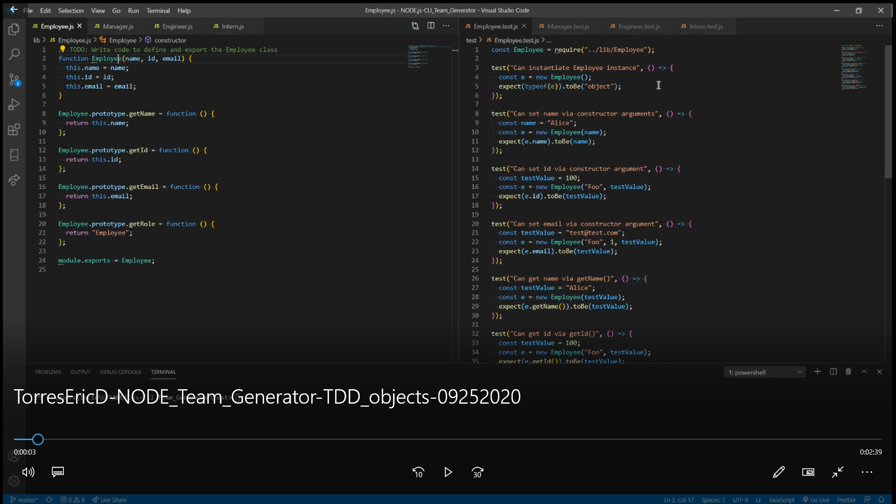
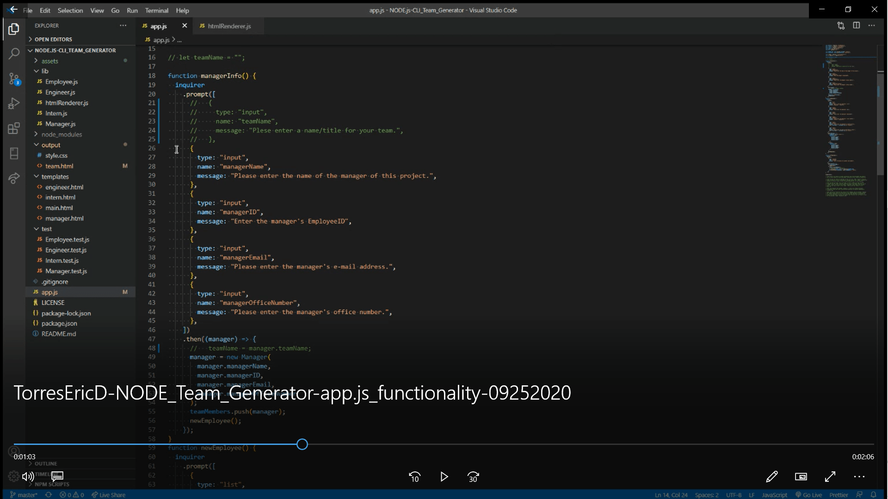
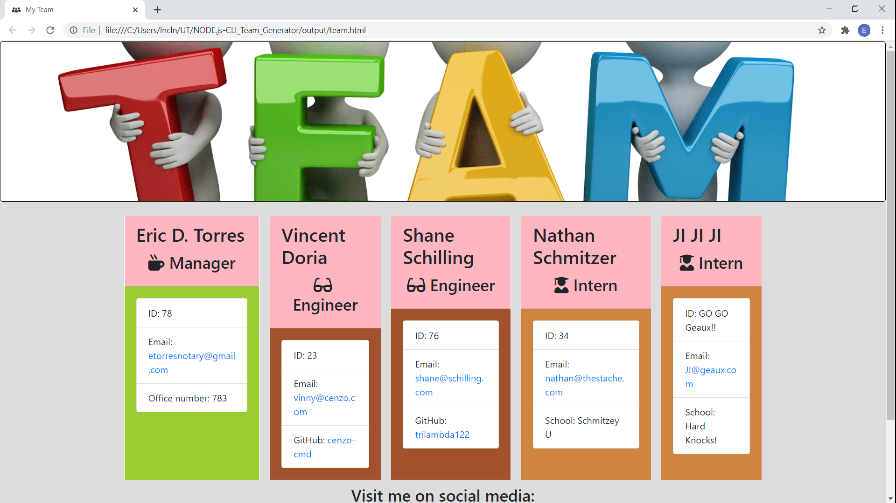
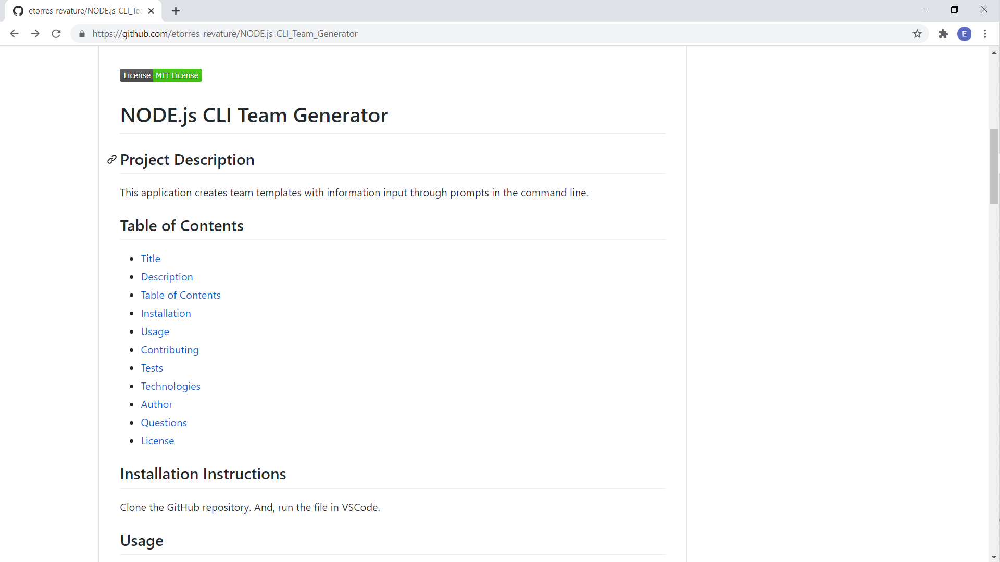

# NODE.js CLI Team Generator

## Project Description

This application creates team templates with information input through prompts in the command line.

This project has been updated to include validation on the Inquirer prompts.  In the ./lib folder there is a Validation object (Validtion.js) filethat is exported to the app.js file to create the validations on the Inquirer prompts.  The Validation object is tested with Validation.test.js file in ./test folder.  

## Table of Contents

* [Title](#project-title)
* [Description](#project-description)
* [Table of Contents](#table-of-congents)
* [Installation](#installation-instructions)
* [Usage](#usage)
* [Contributing](#guidelines-for-contributing)
* [Tests](#tests)
* [Technologies](#technologies-used)
* [Author](#author)
* [Questions](#questions)
* [License](#license)

## Installation Instructions

Clone the GitHub repository.  And, run the file in VSCode.

## Usage 

Type in "node app.js" in the terminal command line.  Follow the prompts.

Here are :movie_camera: **VIDEOS** :movie_camera: that display how to use the application.

1. ***TDD objects*** walk through:

2. ***CODE*** walk through

3. ***PROMPTS*** walk through:

## Guidelines for Contributing

If you want to contibute or have suggestions for new features, please use the e-mail address below.

## Tests

Test early, test often.

### Technologies Used 
### :computer: :computer: :computer: :computer: :computer: :computer: 

#### :memo: HTML5 :memo:

**HTML5** is a markup language used for structuring and presenting content on the World Wide Web.  The goals are to improve the language with support for the latest multi-media and other new features; to keep the language both easily readable by humans and consistently understood by computers and devices; and to remain backward compatible to older software.  Many new symantic features are included.

*HTML5* content borrowed from <a target="_blank" rel="noopener noreferrer">[this page](https://en.wikipedia.org/wiki/HTML5).</a>

#### :art: CSS :art:

**Cascading Style Sheets (CSS)** is a stylesheet language used for describing the presentation of a document written in a markup language (such as HTML5).  CSS is designed to enable the separation of presentation and content; including layout, colors, and fonts.  This separation improves content accessibility to provide more flexibility and control in the specification of presentation characteristics, enabling multiple web pages to share formatting by specifying relevant CSS in a separate file, which reduces complexity and repetition in the structural content (HTML), as well as enabling the file to be cached to improve the page load speed between the pages that share the file and its formatting.

Separation of formating and content also makes it feasible to present the same markup page in different styles for different rendering methods, such as on-screen, in print, by voice, and on Braille-based tactile devices. 

*CSS* content borrowed from <a target="_blank" rel="noopener noreferrer">[this page](https://en.wikipedia.org/wiki/Cascading_Style_Sheets).</a>

#### :shoe: Bootstrap 4 :shoe:

**Bootstrtap 4** is a free and open-source CSS framework directed at responsive, mobile-first front-end web development.  It contains CSS and (optionally) JavaScript-based design templates for typography, forms, buttons, navigation, and other interface components.  

*Bootstrap 4* content borrowed from <a target="_blank" rel="noopener noreferrer">[this page](https://en.wikipedia.org/wiki/Bootstrap_(front-end_framework)).</a>

#### :sparkler: JavaScript :sparkler:

**JavaScript (JS)** is one of the core technologies of the World Wide Web (along with HTML and CSS). It enables interactive web pages and is an essential part of web applications.  JS is a multi-faceted, scripting language that provides versatility through Application Programming Interfaces (APIs) and Document Object Model (DOM) manipulation, among others.

*JavaScript* content borrowed from <a target="_blank" rel="noopener noreferrer">[this page](https://en.wikipedia.org/wiki/JavaScript).</a>

#### :globe_with_meridians: NODE.js :globe_with_meridians:

**NODE.js** is an open-source, corss-platform JavaScript runtime environment that execute JavaScript code outside a web browser.  NODE.js lets developers use JavaScript to write command line tools and for server-side scripting.  NODE.js represents a "Javascript everywhere" paradigm, unifying web-application development around a single programming language, rather than different programming languages for server- and client-side scripts.  

*NODE.js* content borrowed from <a target="_blank" rel="noopener noreferrer">[this page](https://en.wikipedia.org/wiki/Node.js).

[Download Node.js](https://nodejs.org/en/).

### Author 

This *NODE.js CLI Team Generator* was built by :green_heart: Eric D. Torres :green_heart:

## Questions

Check out my [GitHub profile](https://github.com/etorres-revature).

You can contact me by e-mail at etorresnotary@gmail.com for any additional questions and/ or clarifications you may need about the project.

##### License

This application uses the **MIT License**.

**[This README.md file generated with my NODE.js README Generator app.](https://github.com/etorres-revature/NODEjs_README.md_Generator)**

